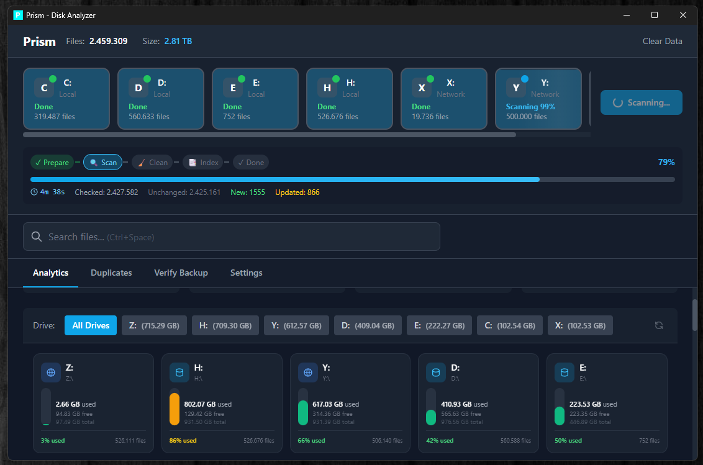
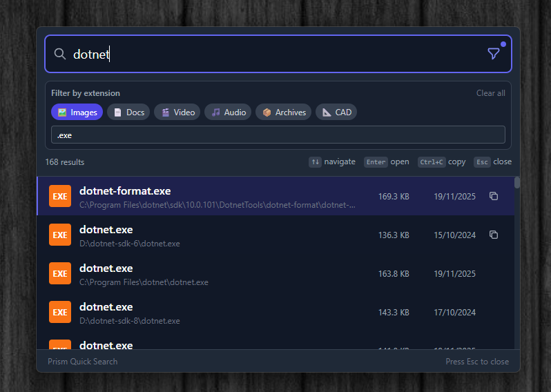
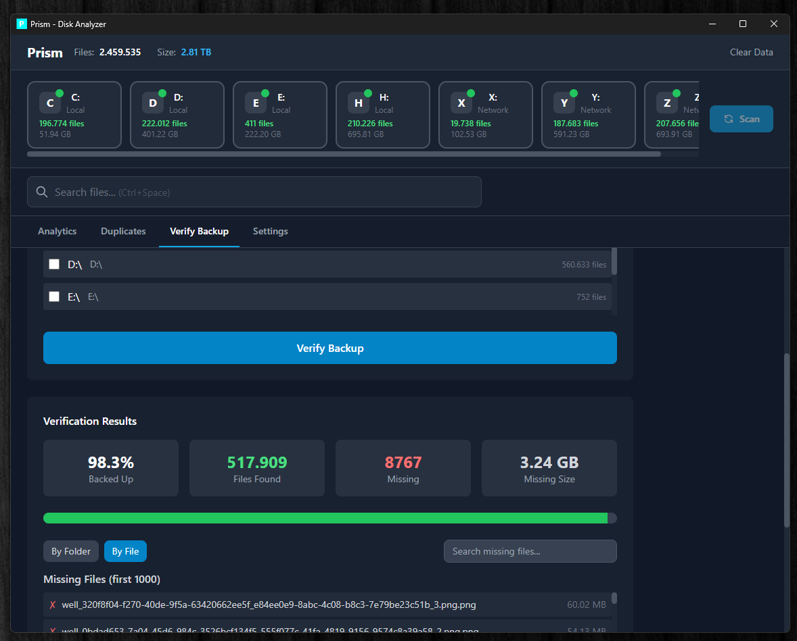

<div align="center">

# Prism

### High-Performance Disk Analyzer & Deduplicator

[](https://tauri.app)
[](https://rust-lang.org)
[](https://kit.svelte.dev)
[](LICENSE)

**Prism** is a blazingly fast disk analyzer built with Rust and modern web technologies.
Scan millions of files in seconds, find duplicates, and visualize your storage like never before.

[Features](#-features) | [Installation](#-installation) | [Usage](#-usage) | [Development](#-development)

</div>

---

## Screenshots

<div align="center">

### Dashboard

*Main dashboard with drive cards, scan progress timer, and analytics*

### Storage Explorer

*Interactive treemap visualization with nested folders and disk usage overview*

### Quick Search

*Global quick search (Ctrl+Space) with file type filters and instant results*

</div>

---

## Features

### Lightning Fast Scanning
- **Parallel file traversal** using jwalk + rayon
- Scans **50,000+ files/second** on SSDs
- **Incremental scanning** - only process changed files after first scan
- **Smart scanning** - automatically chooses between full and incremental

### Powerful Search
- **Unified Quick Search** - Single search experience via search bar or `Ctrl+Space`
- **Full-text search** with FTS5 and BM25 ranking
- **Advanced filters**: `size:>100MB`, `ext:pdf`, `type:video`, `path:Documents`
- **File type filtering** - Filter results by images, videos, documents, etc.
- **Real-time results** with debounced queries (<50ms latency)

### Duplicate Detection
- **Hash-based detection** using BLAKE3 (partial + full)
- **Perceptual hashing** for similar images
- **Batch deletion** with safety confirmations
- **Wasted space calculation** per duplicate group

### Interactive Visualization
- **Tree View** - Pre-expanded hierarchical view of your files
- **Treemap** - Interactive D3.js visualization with drill-down
- **Size distribution** charts by file type and extension
- **Real-time progress** with per-drive tracking

### Cross-Drive Verification
- Verify if all files from one drive exist on backup drives
- **Folder aggregation** - View missing files grouped by folder with sizes
- **Search & filter** - Find specific missing files quickly
- Perfect for backup validation and migration

### Logging & Diagnostics
- **Daily rolling logs** stored in `%LOCALAPPDATA%\Prism\logs`
- **Export logs** for troubleshooting via Settings
- **Open log folder** directly from the app

---

## Installation

### Portable Version (Recommended)

Download the latest portable release from [Releases](https://github.com/caste9612/Prism/releases):

1. Download `Prism-Portable.zip`
2. Extract to any folder
3. Run `Prism.exe`

No installation required. Database is stored in `%APPDATA%\com.prism.diskanalyzer\`.

### Build from Source

**Prerequisites:**
- [Node.js](https://nodejs.org/) 18+
- [Rust](https://rustup.rs/) 1.75+
- [Tauri Prerequisites](https://tauri.app/v2/guides/getting-started/prerequisites)

```bash
# Clone the repository
git clone https://github.com/caste9612/Prism.git
cd Prism

# Install dependencies
npm install

# Run in development mode
npm run tauri dev

# Build for production
npm run tauri build
```

---

## Usage

### Scanning Drives

1. **Select drives** - Click on drive cards to select/deselect
2. **Start scan** - Click "Scan Selected" or let auto-scan run
3. **Monitor progress** - Real-time per-drive progress tracking
4. After first scan, subsequent scans are **incremental** (only changed files)

### Searching Files

Use the search bar with advanced filters:

| Filter | Example | Description |
|--------|---------|-------------|
| `size:` | `size:>100MB` | Files larger than 100MB |
| `ext:` | `ext:pdf,docx` | Specific extensions |
| `type:` | `type:image` | Category (image, video, audio, document, archive) |
| `path:` | `path:Documents` | Path contains text |

**Quick Search:** Press `Ctrl+Space` anywhere for instant global search.

### Finding Duplicates

1. Go to **Duplicates** tab
2. Click **Find Duplicates**
3. Review groups (first file is marked as "original")
4. Select files to delete and confirm

### Visualization

Switch between views using the toggle:
- **Tree View** - Hierarchical folder structure with sizes
- **Treemap** - Visual representation of space usage

---

## Tech Stack

| Layer | Technology |
|-------|------------|
| **Framework** | [Tauri 2.0](https://tauri.app) |
| **Frontend** | [SvelteKit 2.0](https://kit.svelte.dev), [TailwindCSS](https://tailwindcss.com), [D3.js](https://d3js.org) |
| **Backend** | [Rust](https://rust-lang.org) |
| **Database** | SQLite with WAL mode, FTS5 |

### Key Libraries

| Library | Purpose |
|---------|---------|
| **jwalk** | Parallel directory traversal |
| **rayon** | Data parallelism |
| **blake3** | Fast cryptographic hashing |
| **rusqlite** | SQLite bindings |
| **image** | Perceptual hashing |

---

## Architecture

```
Prism/
├── src/                    # SvelteKit frontend
│   ├── lib/
│   │   ├── components/     # Svelte components
│   │   │   ├── analytics/  # StorageExplorer, FileCategories, charts
│   │   │   ├── common/     # Modal, Toast, Skeleton
│   │   │   └── dashboard/  # DriveCard, ScanProgress
│   │   ├── stores/         # Svelte stores (state management)
│   │   └── utils/          # Formatting utilities
│   └── routes/             # SvelteKit pages
├── src-tauri/              # Rust backend
│   └── src/
│       ├── commands/       # Tauri IPC commands
│       ├── database/       # SQLite with FTS5
│       ├── scanner/        # Parallel file walker
│       ├── search/         # Search engine
│       └── duplicates/     # Hash-based detection
└── docs/                   # Documentation
```

---

## Performance

| Metric | Value |
|--------|-------|
| **Scan speed** | 50,000+ files/sec (SSD) |
| **Search latency** | <50ms |
| **FTS indexing** | ~100,000 files/sec |
| **Memory usage** | ~100MB during scan |

---

## Keyboard Shortcuts

| Shortcut | Action |
|----------|--------|
| `Ctrl+Space` | Open Quick Search (global) |
| `Escape` | Close Quick Search / Cancel |
| `Enter` | Open selected file |

---

## Development

### Commands

```bash
npm run tauri dev      # Development with hot reload
npm run check          # TypeScript type checking
npm test               # Frontend tests (Vitest)
cargo test             # Backend tests

npm run tauri build    # Production build
```

### Documentation

- [Features](docs/FEATURES.md) - Complete feature guide
- [Architecture](docs/ARCHITECTURE.md) - System design and patterns
- [API Reference](docs/API.md) - Tauri commands and events
- [Changelog](docs/CHANGELOG.md) - Version history
- [Development](docs/DEVELOPMENT.md) - Setup and guidelines

---

## Roadmap

- [x] High-performance parallel scanning
- [x] FTS5 full-text search
- [x] Duplicate detection (hash + perceptual)
- [x] Interactive tree view
- [x] Smart incremental scanning
- [x] Database corruption prevention
- [x] Cross-drive file verification
- [x] Unified Quick Search experience
- [x] File logging & export
- [x] Quick Search file type filters
- [x] Storage Explorer V2 with nested treemap
- [x] Scan progress timer
- [x] Right-click to open in Explorer
- [ ] Similar images comparison UI
- [ ] Excel export
- [ ] Theme toggle (dark/light)
- [ ] Scheduled scans

---

## Contributing

Contributions are welcome! Please read [DEVELOPMENT.md](docs/DEVELOPMENT.md) first.

1. Fork the repository
2. Create a feature branch (`git checkout -b feature/amazing`)
3. Commit changes (`git commit -m 'Add amazing feature'`)
4. Push to branch (`git push origin feature/amazing`)
5. Open a Pull Request

---

## License

MIT License - see [LICENSE](LICENSE) for details.

---

<div align="center">

**Built with Rust and love**

</div>
